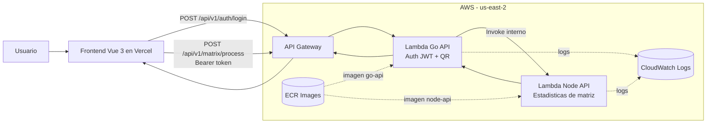

# Challenge Interseguro

Solucion tecnica basada en microservicios para procesamiento de matrices:

- Backend principal: Go + Fiber (autenticacion JWT y factorizacion QR)
- Backend secundario: Node.js + Express + TypeScript (estadisticas de matrices)
- Frontend: Vue 3 + Vite + Pinia + Axios

## Arquitectura

Flujo de negocio:

Cliente -> Go API -> Node API -> Respuesta (QR + estadisticas)

- La Go API expone endpoints publicos.
- La Node API actua como servicio interno de estadisticas.
- El frontend autentica, obtiene JWT y consume el procesamiento de matrices.

### Diagrama de arquitectura



### Explicacion breve

1. El usuario interactua con el frontend en Vue.
2. El frontend llama a la Go API para autenticacion y procesamiento.
3. La Go API valida JWT y ejecuta la logica principal (factorizacion QR).
4. Para estadisticas, la Go API consume internamente la Node API.
5. API Gateway publica el backend y CloudWatch centraliza observabilidad.

Esta separacion permite mantener responsabilidades claras por servicio y facilita escalar o modificar cada componente sin romper el flujo completo.

## Estructura del repositorio

```text
.
|- go-api/
|- node-api/
|- frontend-vue/
|- infra/
|- docker-compose.yml
|- .env.example
`- README.md
```

## Requisitos

- Docker + Docker Compose
- Node.js 20+
- Go 1.22+ (si ejecutas Go en local sin Docker)
- AWS CLI y credenciales configuradas (solo para despliegue cloud)

## Inicio rapido local

### Opcion recomendada: Docker Compose

1. Crea variables locales de Compose:

```bash
cp .env.example .env
```

2. Levanta servicios:

```bash
docker compose up --build
```

3. Servicios disponibles:

- Go API: http://localhost:8080
- Node API: http://localhost:3000
- Swagger Go: http://localhost:8080/api-docs/index.html
- Swagger Node: http://localhost:3000/api-docs

### Opcion manual (sin Docker)

Node API:

```bash
cd node-api
npm install
npm run dev
```

Go API:

```bash
cd go-api
go mod tidy
go run cmd/api/main.go
```

Frontend:

```bash
cd frontend-vue
npm install
npm run dev
```

## Variables de entorno

Regla general:

- Se versionan solo archivos `.env.example`.
- Los `.env` reales se crean localmente y no se suben a Git.

### Frontend (Vite)

Archivo ejemplo: `frontend-vue/.env.example`

```bash
cp frontend-vue/.env.example frontend-vue/.env
```

Variable principal:

- `VITE_GO_API_BASE_URL`

Ejemplos:

- Local: `http://localhost:8080/api/v1`
- Cloud: `https://<api-id>.execute-api.us-east-2.amazonaws.com/prod/api/v1`

Nota: solo variables con prefijo `VITE_` quedan expuestas al frontend.

### Go API

Archivo ejemplo: `go-api/.env.example`

```bash
cp go-api/.env.example go-api/.env
```

Variables:

- `JWT_SECRET`
- `ADMIN_USERNAME`
- `ADMIN_PASSWORD`
- `NODE_SERVICE_URL`
- `CORS_ALLOWED_ORIGINS` (opcional, lista separada por comas)

### Node API

Archivo ejemplo: `node-api/.env.example`

```bash
cp node-api/.env.example node-api/.env
```

Variable actual:

- `PORT` (por defecto 3000)

## Login del frontend

El usuario y password del login son exactamente:

- `ADMIN_USERNAME`
- `ADMIN_PASSWORD`

configurados en la Go API.

## Endpoints principales

Go API:

- `POST /api/v1/auth/login`
- `POST /api/v1/matrix/process` (requiere JWT)

Node API:

- `POST /api/stats`

## Documentacion Swagger

### Local

- Go API Swagger UI: `http://localhost:8080/api-docs/index.html`
- Go API OpenAPI JSON: `http://localhost:8080/api-docs/doc.json`
- Node API Swagger UI: `http://localhost:3000/api-docs`
- Node API OpenAPI JSON (opcional): `http://localhost:3000/api-docs.json`

### En linea (AWS)

Si el backend esta desplegado en API Gateway, las rutas esperadas son:

- Go API Swagger UI: `<GoApiGatewayUrl>api-docs/index.html`
- Go API OpenAPI JSON: `<GoApiGatewayUrl>api-docs/doc.json`
- Node API Swagger UI: `<NodeApiGatewayUrl>api-docs`
- Node API OpenAPI JSON (opcional): `<NodeApiGatewayUrl>api-docs.json`

Con tu URL actual de Go API, deberia verse en:

- `https://4rdn0yko8d.execute-api.us-east-2.amazonaws.com/prod/api-docs/index.html`
- `https://4rdn0yko8d.execute-api.us-east-2.amazonaws.com/prod/api-docs/doc.json`

Resumen rapido:

- En Go son 2 enlaces importantes: UI + `doc.json`.
- En Node normalmente usas 1 enlace principal: UI (`/api-docs`).
- Si necesitas integracion con Postman u otra herramienta, usa tambien el JSON de Node (`/api-docs.json`).
- Los ejemplos mostrados en Swagger fueron ajustados para reflejar payloads reales del reto (usuario/password, matriz y estadisticas), no placeholders genericos.

Para obtener las URLs reales del stack desde CloudFormation:

```bash
aws cloudformation describe-stacks \
	--stack-name InterseguroPlatformStack \
	--region us-east-2 \
	--query "Stacks[0].Outputs[?OutputKey=='GoApiGatewayUrl' || OutputKey=='NodeApiGatewayUrl'].[OutputKey,OutputValue]" \
	--output table
```

Notas:

- Si `NodeApiGatewayUrl` no existe o devuelve `403`, es porque en esa variante de despliegue Node puede estar privado.
- Si ves `502`, revisa logs en CloudWatch de la Lambda correspondiente.

## Tests

Node:

```bash
cd node-api
npm test
```

Go:

```bash
cd go-api
go test ./...
```

## Despliegue cloud

### Backend en AWS

Infraestructura y comandos detallados en [infra/README.md](infra/README.md).

### Frontend en Vercel

1. Configura Root Directory en `frontend-vue`.
2. Define `VITE_GO_API_BASE_URL` en Production y Preview.
3. Cada push a `main` dispara deployment automatico.

## Troubleshooting rapido

- CORS error en login:
	- revisa `CORS_ALLOWED_ORIGINS` en Go API
	- valida origen de Vercel (`https://*.vercel.app`)
- `Runtime.InvalidEntrypoint` en Lambda Go:
	- reconstruye y despliega la imagen de `go-api`
- `502 Internal server error` en API Gateway:
	- revisa logs de `/aws/lambda/interseguro-go-api` en CloudWatch
- Swagger muestra `Failed to load API definition` y `500 doc.json`:
	- valida que Go API importe el paquete `challenge-go/docs`
	- reconstruye imagen de Go y actualiza Lambda
- Swagger de Go muestra solo 1 endpoint:
	- valida que las anotaciones `@Router` esten sobre funciones exportadas (no dentro de funciones anonimas)
	- reconstruye la imagen de Go para regenerar y publicar docs actualizados

## Stack tecnologico

- Go + Fiber
- Node.js + Express + TypeScript
- Vue 3 + Pinia + Axios + Tailwind
- Docker / Docker Compose
- AWS Lambda (container images) + API Gateway + ECR
- Vercel (frontend)
